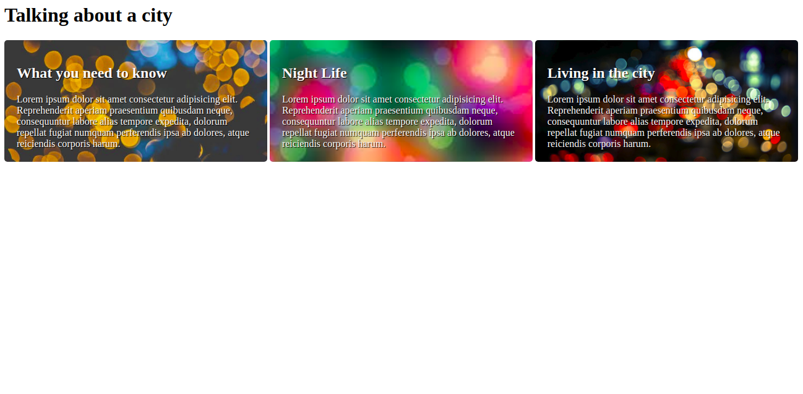

# What's your background? 

**Note**: The task starting files can be found in the corresponding folder names. Each task folder contains the necessary assets.

## Task 1: 
- Set `background.jpg` from the assets folder as the background image of the header. 
- Set the size to `contain` and make sure the image **repeats** across the header. 

## Task 2: 
- Add the background images from the assets folder to each of the sections with the classes `info-1`, `info-2` and `info-3` 
- Set the size of the background to cover the whole section element. 
- Make sure that the background does not repeat and that the position is set to bottom.  

### Bonus for task 2 
* Add padding to the sections. 
* Make the sections appear side-by-side. 
* Add a border radius to the sections.

[//]: # (autograding info start)
#  Results
> ⌛ Give it a minute. As long as you see the orange dot  on top, CodeBuddy is still processing. Refresh this page to see it's current status.
>
> This is what CodeBuddy found when running your code. It is to show you what you have achieved and to give you hints on how to complete the exercise.

### Task 1: Header

|                 Status                  | Check                                                                                    |
| :-------------------------------------: | :--------------------------------------------------------------------------------------- |
|  | `Header` should have `background.jpg` as background |
|  | Background size should be set to `contain` |
|  | Image should repeat itself across the Header element |

### Task 2: Section background

|                 Status                  | Check                                                                                    |
| :-------------------------------------: | :--------------------------------------------------------------------------------------- |
|  | Page should use images from the asset folder as background images |
|  | Background image size should be set to `cover` |
|  | Background images should not be repeated in the element |
|  | Background images should be positioned at the bottom |

[🔬 Results Details](../../actions)
[🐞 Tips on Debugging](https://github.com/DCI-EdTech/autograding-setup/wiki/How-to-work-with-CodeBuddy)
[📢 Report Problem](https://docs.google.com/forms/d/e/1FAIpQLSfS8wPh6bCMTLF2wmjiE5_UhPiOEnubEwwPLN_M8zTCjx5qbg/viewform?usp=pp_url&entry.652569746=UIB-boxmodel-backgroundimages)

[//]: # (autograding info end)