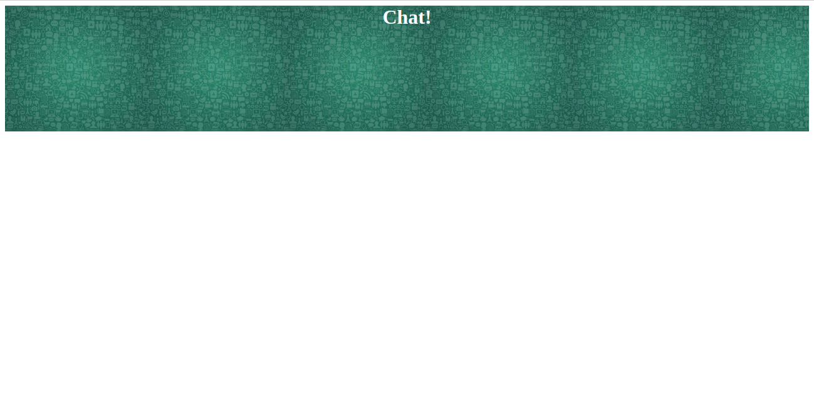

# What's your background? 

**Note**: The task starting files can be found in the corresponding folder names. Each task folder contains the necessary assets.

## Task 1: 
- Set `background.jpg` from the assets folder as the background image of the header. 
- Set the size to `contain` and make sure the image **repeats** across the header. 

## Task 2: 
- Add the background images from the assets folder to each of the sections with the classes `info-1`, `info-2` and `info-3` 
- Set the size of the background to cover the whole section element. 
- Make sure that the background does not repeat and that the position is set to bottom.  

### Bonus for task 2 
* Add padding to the sections. 
* Make the sections appear side-by-side. 
* Add a border radius to the sections.

